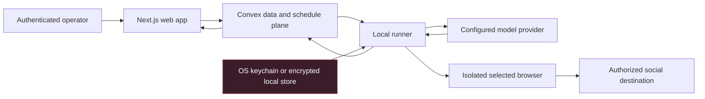
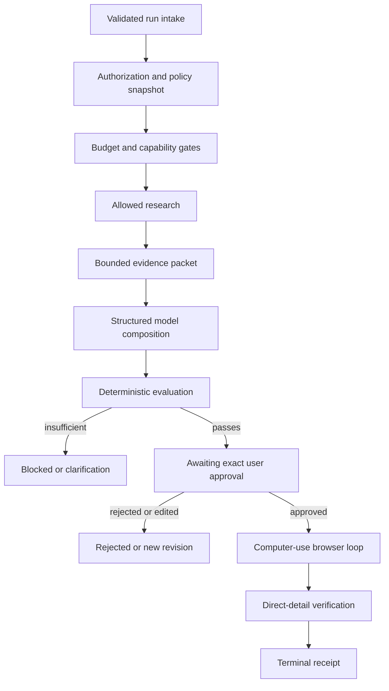
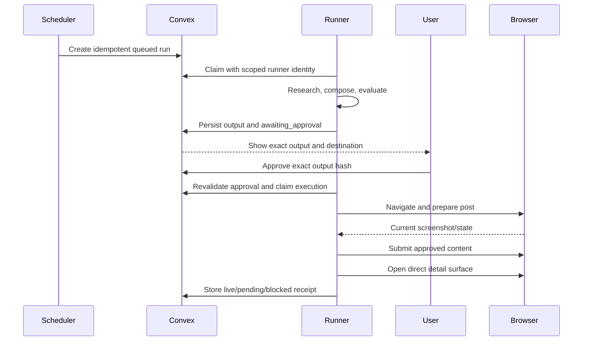

# System Visuals

These diagrams describe the proposed architecture, not implemented behavior.

## System boundary

Provider secrets and browser state remain local. Convex receives metadata,
configuration, evidence, outputs, approvals, receipts, and audit—not plaintext
keys or cookies.

## Agent harness

## Publication state sequence

